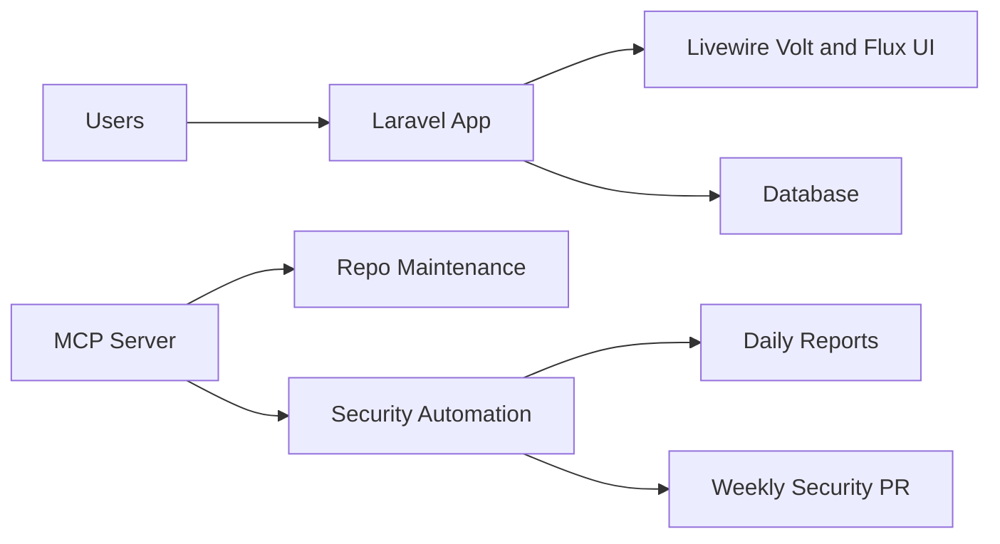

# Linavelt

[](https://laravel.com)
[](https://www.php.net)
[](https://livewire.laravel.com)
[](https://tailwindcss.com)
[](https://nodejs.org)
[](https://modelcontextprotocol.io)

Linavelt is a Laravel + Livewire platform for building and managing modern, module-driven web experiences, paired with an MCP server that automates repository maintenance and security operations.

## Why This Project Exists

Linavelt is designed to bring three concerns into one practical system:

- Product velocity: ship pages, modules, and admin workflows quickly.
- Operational reliability: continuously monitor and maintain repo and dependency health.
- Secure automation: run controlled daily and weekly security routines with review-friendly outputs.

## End Goals

- Deliver a scalable application foundation for content, admin tooling, and onboarding flows.
- Provide a first-class DX using Laravel, Livewire Volt/Flux, Tailwind v4, and Vite.
- Keep security hygiene automated through MCP-backed daily audits and weekly update workflows.
- Support both web and desktop packaging paths (Electron) from one codebase.

## Core Capabilities

- Laravel 12 backend with Fortify authentication and two-factor support.
- Livewire + Volt + Flux UI architecture for rich, reactive interfaces.
- Tailwind CSS v4 pipeline with Vite for fast frontend iteration.
- Blog/admin and builder onboarding routes for product workflows.
- MCP server endpoints for repo updates, audits, and health checks.
- Scheduler-based security automation with report generation and weekly PR strategy.

## System Architecture



## Tech Stack

- Backend: Laravel 12, PHP 8.2+, Fortify, PHPUnit
- Frontend: Livewire, Volt, Flux/Flux Pro, Tailwind CSS v4, Vite
- Automation: Node.js 22+, Express, Model Context Protocol SDK
- Packaging: Electron + electron-builder
- Quality and CI: Laravel Pint, PHPUnit, GitHub Actions

## Quick Start

### 1. Install application dependencies

```bash
composer config http-basic.composer.fluxui.dev <flux-username> <flux-license-key>
composer install
npm install
```

### 2. Configure environment

```bash
cp .env.example .env
php artisan key:generate
php artisan migrate
```

### 3. Run the Laravel app

```bash
php artisan serve
```

### 4. Run frontend tooling

```bash
npm run dev
```

## MCP Server

The MCP server lives in mcp-server/ and is responsible for repository and security automation tasks.

### Start

```bash
cd mcp-server
npm install
sh ./start-daemon.sh
```

### Health Check

```bash
curl http://127.0.0.1:4000/health
```

### Stop

```bash
cd mcp-server
sh ./stop-daemon.sh
```

### Key Environment Variables

- MCP_API_KEY: required for protected MCP endpoints.
- GITHUB_REPOSITORY: optional owner/repo hint for automation.
- AUTOMATION_POLICY_PROFILE: selects automation behavior profile.

## Security Automation

The scheduler and automation scripts in mcp-server/ provide:

- Daily dependency and platform security checks.
- Daily report output in mcp-server/security-reports/.
- Weekly consolidated update branch and pull request flow.

Run readiness checks before enabling full automation:

```bash
cd mcp-server
npm run automation:readiness
npm run automation:start
```

## Testing and Quality

```bash
npm run check:preflight
```

Direct commands:

```bash
php artisan test
./vendor/bin/pint
npm run build
npm run security:audit
npm run release:smoke
```

Preflight runs the full local quality gate in one command and reports warnings for environment-only blockers (for example, missing PHP/composer or missing GitHub CLI authentication).

For Laravel test execution, preflight requires PHP `pdo` plus at least one driver (`pdo_sqlite` or `pdo_mysql`). If those modules are unavailable in the current runtime, preflight will skip tests with a warning instead of failing the entire run.

## Podman Pod Workflow

Use the one-command pod bootstrap to build images, start the pod, run migrations, and verify health:

```bash
APP_KEY="$(openssl rand -base64 32 | sed 's#^#base64:#')" MCP_API_KEY="dev-local-key" sh ./containers/quadlet/up.sh
```

This starts:

- Laravel app on `http://127.0.0.1:8000`
- MCP server on `http://127.0.0.1:4000/health`
- MariaDB on `127.0.0.1:3306`

## Always-On Remote Deployment

If you want Linavelt and the MCP server to run 24/7 without depending on your local machine, use the remote GHCR + quadlet deployment package:

1. Push to `main` so GitHub Actions publishes images to GitHub Container Registry.
2. On your always-on Linux host, install the remote quadlet units from `containers/remote-quadlet/`.
3. Restart the host units whenever a new image tag is published.

The deployment package lives in:

- `containers/remote-quadlet/README.md`

Relevant automation:

- `.github/workflows/publish-containers.yml`

Operational commands:

```bash
npm run release:smoke
cd mcp-server && npm run automation:report
```

## Key Project Paths

- app/: Laravel application code (controllers, jobs, Livewire, providers)
- resources/: frontend assets and Blade views
- routes/: web/auth/console routes
- tests/: feature and unit tests
- mcp-server/: automation and MCP server runtime
- docs/plan/: roadmap and planning documents
- docs/design/: architecture and integration design notes
- docs/operate/: runbooks and operational guides
- scripts/build/: local quality gate and preflight checks
- scripts/release/: release smoke tests and packaging helpers
- scripts/ops/: infrastructure and runner setup scripts
- containers/: Podman quadlet units and remote deployment configs

## Documentation

- docs/plan/ROADMAP_EXECUTION_PLAN.md
- docs/design/ELECTRON_INTEGRATION.md
- docs/operate/SECURITY_AUTOMATION_RUNBOOK.md
- docs/operate/container-security.md
- mcp-server/README.md

## Roadmap Direction

- Expand module generation workflows and admin controls.
- Deepen builder integrations for page and content authoring.
- Increase automation observability (alerts, dashboards, and run intelligence).
- Tighten release workflows for web and Electron distribution.

## Roadmap Execution

Roadmap initiatives are tracked and sequenced in:

- docs/plan/ROADMAP_EXECUTION_PLAN.md

Recommended initiation order:

1. Lock release workflow and always-on deployment first so new work can be shipped and hosted continuously.
2. Keep automation observability current so daily and weekly repo health is visible without log scraping.
3. Continue module generation and admin controls once delivery and hosting are stable.
4. Finish builder integrations after the scaffolding and operations path are stable.

Initial execution already in-repo:

- Automation observability summary command: `cd mcp-server && npm run automation:report`
- PR release-readiness workflow: `.github/workflows/release-readiness.yml`
- Electron release smoke command: `npm run release:smoke`

## Contributing

Contributions are welcome through focused pull requests with clear test coverage and changelog-ready summaries.

## License

This project is licensed under the MIT License.
